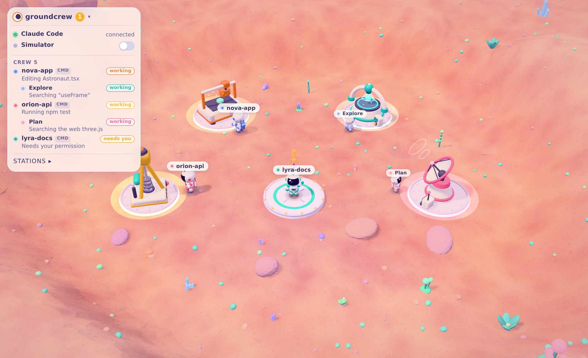

# agentnauts

A cartoon 3D visualizer for AI coding agents. Every Claude Code session becomes a
little astronaut working on a base on an alien planet, seen from above: it walks to the
**fabricator** to edit files, the **scanner** to read and search, the **drill**
to run shell commands and the **radar dish** to search the web or use outside
tools (MCP). When the agent
needs you, its astronaut waits on the landing pad with a big **!** over its head.
Subagents drop in as smaller crew astronauts and fly off when they're done.

Inspired by Pixel Agents, but in 3D, with a soft pastel, Astroneer-like toy
style (all art is original, built from primitives).



## Quick start

Requires Node.js 20.19+ (or 22.12+).

```bash
npm install
npm run dev          # daemon on :4747 + web app on :5173
```

Open <http://localhost:5173>. In dev the **simulator** is on, so two fake
agents start working right away. Toggle it in the HUD (top left); the choice is
remembered. Production builds (`npm start`, served on :4173) start with it off.

To see your real Claude Code sessions:

1. **Sign in** in the HUD (a link is emailed to you, no password).
2. **Connect this computer**: the daemon prints a link when it starts. Open
   it in the browser where you are signed in, check that the page shows the
   same ID as the terminal, and click **Connect**.
3. **Add the hooks** (next section) and start a Claude Code session.

| Command             | What it does                                                        |
| ------------------- | ------------------------------------------------------------------- |
| `npm run dev`       | Daemon (`tsx watch`) and Vite dev server together                   |
| `npm run web`       | Only the web app                                                    |
| `npm run server`    | Only the daemon                                                     |
| `npm run typecheck` | Strict TypeScript check of all workspaces                           |
| `npm test`          | Unit tests, including the database access rules                     |
| `npm run build`     | Typecheck, then build `web/dist` and `server/dist`                  |
| `npm start`         | Build, then run the bundled daemon and `vite preview`               |
| `npm run check:cloud -w server` | Check this computer's connection against the real Supabase project |

## Connecting Claude Code

1. Start the daemon (`npm run dev` or `npm run server`). It listens on port 4747.
2. Add these hooks to `.claude/settings.json` in your project, or to
   `~/.claude/settings.json` to watch every project. (The same file is in
   [`docs/claude-settings.example.json`](docs/claude-settings.example.json).)
   If the file already has a `hooks` section, merge these entries into it.

```json
{
  "hooks": {
    "PreToolUse": [
      {
        "matcher": "*",
        "hooks": [
          {
            "type": "command",
            "command": "curl -s -X POST -H 'Content-Type: application/json' -d @- http://localhost:4747/event || true"
          }
        ]
      }
    ],
    "PostToolUse": [
      {
        "matcher": "*",
        "hooks": [
          {
            "type": "command",
            "command": "curl -s -X POST -H 'Content-Type: application/json' -d @- http://localhost:4747/event || true"
          }
        ]
      }
    ],
    "PostToolUseFailure": [
      {
        "matcher": "*",
        "hooks": [
          {
            "type": "command",
            "command": "curl -s -X POST -H 'Content-Type: application/json' -d @- http://localhost:4747/event || true"
          }
        ]
      }
    ],
    "UserPromptSubmit": [
      {
        "hooks": [
          {
            "type": "command",
            "command": "curl -s -X POST -H 'Content-Type: application/json' -d @- http://localhost:4747/event || true"
          }
        ]
      }
    ],
    "Notification": [
      {
        "hooks": [
          {
            "type": "command",
            "command": "curl -s -X POST -H 'Content-Type: application/json' -d @- http://localhost:4747/event || true"
          }
        ]
      }
    ],
    "Stop": [
      {
        "hooks": [
          {
            "type": "command",
            "command": "curl -s -X POST -H 'Content-Type: application/json' -d @- http://localhost:4747/event || true"
          }
        ]
      }
    ],
    "SubagentStart": [
      {
        "hooks": [
          {
            "type": "command",
            "command": "curl -s -X POST -H 'Content-Type: application/json' -d @- http://localhost:4747/event || true"
          }
        ]
      }
    ],
    "SubagentStop": [
      {
        "hooks": [
          {
            "type": "command",
            "command": "curl -s -X POST -H 'Content-Type: application/json' -d @- http://localhost:4747/event || true"
          }
        ]
      }
    ],
    "SessionStart": [
      {
        "hooks": [
          {
            "type": "command",
            "command": "curl -s -X POST -H 'Content-Type: application/json' -d @- http://localhost:4747/event || true"
          }
        ]
      }
    ],
    "SessionEnd": [
      {
        "hooks": [
          {
            "type": "command",
            "command": "curl -s -X POST -H 'Content-Type: application/json' -d @- http://localhost:4747/event || true"
          }
        ]
      }
    ]
  }
}
```

3. Start (or restart) Claude Code. Its astronaut lands on the pad and gets to
   work. The HUD shows **Claude Code: connected** and counts incoming events.

Each hook pipes the hook's JSON (stdin) to the daemon. `|| true` means a stopped
daemon never breaks Claude Code: curl fails fast with "connection refused" and
the hook still exits 0. The daemon replies with an empty body, so nothing ends
up on the hook's stdout.

`SessionEnd` makes the commander fly home when you quit, `SubagentStart` drops
crew in as soon as a subagent launches, and `UserPromptSubmit` shows
"Thinking…". Sessions that go quiet for 30 minutes fly home on their own.

### Try it without Claude Code

```bash
curl -s -X POST -H 'Content-Type: application/json' \
  -d '{"session_id":"demo","cwd":"/tmp/my-project","hook_event_name":"PreToolUse","tool_name":"Bash","tool_input":{"command":"npm test"}}' \
  http://localhost:4747/event
```

## What the astronauts do

| Event                                        | Astronaut                                                       |
| -------------------------------------------- | --------------------------------------------------------------- |
| `Edit`, `Write`, `MultiEdit`, `NotebookEdit` | walks to the **fabricator** (orange) and works                  |
| `Read`, `Grep`, `Glob`, `LS`                 | **scanner** (teal)                                              |
| `Bash`                                       | **drill** (yellow)                                              |
| `WebSearch`, `WebFetch`, MCP tools (`mcp__…`) | **radar dish** (pink)                                          |
| `Notification` (permission / input needed)   | goes to the **landing pad**, shows a floating **!**             |
| `Stop`, tools without a station (`Task`, `TodoWrite`, …) | idle; the HUD still says what it is doing           |
| no events for ~8 s                           | wanders around the base, pauses, looks around                   |
| tool call inside a subagent (`agent_id`)     | a smaller **crew** astronaut drops in and does it               |
| `SubagentStop`                               | that crew astronaut jetpacks away                               |

Stations react while someone works at them: glowing ground ring, faster
machinery, sparks, data bits or dust.

## Architecture

```
Claude Code hooks ──curl POST /event──▶ server/ (daemon, :4747)
                                          │ normalize.ts: hook JSON → AgentEvent
                                          │ connections.ts: sign, one send-only
                                          │   token per room (from agent-auth)
                                          ▼
                              Supabase Realtime (private channels)
                                          │
web/  ┌───────────────────────────────────▼───────────────────────────────┐
      │ sources/   RoomSource (your personal room, a shared room) ·        │
      │            SimulatorSource · BridgeSource (local mode)            │
      │            all implement AgentEventSource; attachSource() is the  │
      │            only glue to the store                                 │
      │                       │ AgentEvent                                │
      │ store/     applyEvent → mapEventToIntent (shared, pure)           │
      │            zustand map of agents: plain serializable data only    │
      │                       │ getState() in useFrame                    │
      │ scene/     AgentActor (pathing, turning, lifecycle flights)       │
      │              └─ Astronaut (visual, driven by a pose ref)          │
      │            stations react via useStationActivity refs             │
      │ hud/       status, computers, rooms, agent list                   │
      └───────────────────────────────────────────────────────────────────┘
```

The page never talks to the daemon (except in local mode): everything goes
through Supabase, so the app can be hosted anywhere and opened on any device.

**Workspaces**

- `shared/`: `AgentEvent` (normalized event), `Intent`, the pure
  `mapEventToIntent` function, signed-message and pairing-link formats.
- `server/`: the daemon. Plain `node:http` + `ws`: `POST /event`,
  `GET /health`, `GET /status`, `WS /ws` (local mode). Unknown or malformed
  payloads are logged and ignored, never fatal.
- `supabase/`: migrations (rooms, agent credentials, access rules) and the
  `agent-auth` Edge Function.
- `web/`: Vite + React + TypeScript, three.js via `@react-three/fiber` and
  `@react-three/drei`, zustand.

**Key files**

- `web/src/world/config.ts`: every station position, approach point, the
  landing pad, decorations, palette and camera limits.
- `web/src/world/terrain.ts`, `navigation.ts`: terrain height function
  (shared by the mesh and the feet) and waypoint pathing around obstacles.
- `web/src/store/agentStore.ts`: agents keyed by session id (crew:
  `sessionId/agentId`), `applyEvent` / `spawnAgent` / `removeAgent`, idle and
  wander timers.
- `web/src/scene/agents/AgentActor.tsx`: per-frame behavior; reads the store
  with `getState()` and moves using `delta`.
- `web/src/scene/agents/Astronaut.tsx` and `scene/stations/*`: visuals only.

**Design rules that keep future work open**

- *Rooms*: a room is just another `AgentEventSource` (`sources/room.ts`);
  the scene doesn't know events are remote. The store holds only plain data,
  so it stays easy to sync.
- *Art pass*: the astronaut is driven entirely by an `AstronautPose` ref
  (`idle` / `walk` / `work` / `wait` / `fly`, speed, station). A GLTF model
  just maps those modes to animation clips. Stations are separate components
  that receive an `activity` ref (0..1).

## Accounts, computers and rooms

Your computers send your agents to **your personal room**, which only you can
watch. Share a **room** with teammates and everyone's astronauts work on the
same base. Rooms are private: the room's owner decides who gets in.

```
your Claude Code ──hooks──▶ your daemon ──signed events──▶ your personal room ──▶ your browser
                                 │
                                 └──signed, details removed──▶ shared room ──▶ members' browsers
```

**Using it** (HUD, top left):

1. **Sign in** with your email: click the link Supabase emails you (no password).
2. **Connect a computer**: open the link its daemon prints, compare the ID,
   click **Connect**. It shows up under **Your computers**; **disconnect**
   cuts it off at once.
3. **Create a room**, or **ask to join** one with its code / invite link. The
   owner sees your request (name + email) and clicks **Let in** or **Deny**.
   Owners can remove people and delete the room later.
4. Once you're in a room, your computers are connected to it too and your
   agents are shared there (a computer picks this up within half a minute).
   **Stop sharing** keeps you watching. Other people's astronauts show up
   labelled `name · project`.

**How a computer is trusted.** The daemon never holds your account session.
Each computer has an Ed25519 key pair (`~/.agentnauts/identity.json`,
readable only by you). Connecting a computer registers its *public* key for
one room. To publish, the daemon signs a timestamp with its private key and
the `agent-auth` function answers with a one-hour token for each room that
key is connected to. Such a token can do exactly one thing: send events to
that room's channel. It cannot read the room, see your other rooms or change
anything, and it stops working the moment the computer is disconnected,
removed from the room, or the room is deleted.

**How it's hosted:** one [Supabase](https://supabase.com) project serves
everyone using this build: sign-in, the tables, the `agent-auth` function and
Realtime private channels (events are relayed, never stored). **One-time
setup for the maintainer only:**

1. Create a free Supabase project and paste its project URL and anon
   (publishable) key into [`shared/src/cloud.ts`](shared/src/cloud.ts)
   (Project Settings → API). The anon key is meant to be public.
2. Run the files in [`supabase/migrations`](supabase/migrations), in order,
   in the SQL editor.
3. Deploy [`supabase/functions/agent-auth`](supabase/functions/agent-auth/index.ts)
   as an Edge Function named `agent-auth`, and add the secret
   `AGENT_JWT_SECRET` (Edge Functions → Secrets) with the project's legacy
   JWT secret (Project Settings → JWT Keys).
4. Authentication → Sign In / Providers: keep **Email** enabled. In
   Authentication → URL Configuration, set the Site URL to where people open
   the app (e.g. `http://localhost:5173`) and add it under Redirect URLs, so
   the sign-in link in the email brings people back to it. The built-in email
   sender is rate-limited (a few emails per hour); for bigger teams add your
   own SMTP. With SMTP set up you can also add `{{ .Token }}` to the Magic
   Link template, and the app accepts the code from the email as well.
5. Realtime → Settings: turn **off** "Allow public access", so only signed-in
   members can use channels at all.

`npm run check:cloud -w server` checks a connected computer against the real
project. The access rules are tested against a real Postgres in
`server/src/db.test.ts`, and the function in `server/src/agentAuth.test.ts`
(run with `npm test`).

**Privacy and identity.**

- *Only you* can watch your personal room. *Only people the owner lets in*
  can watch a shared room. That's enforced by the database (row level
  security on Realtime channels), not by the app. Knowing a room code only
  lets you *ask*. Email addresses are shown to the room owner only.
- *Nothing is shared with others until you join or create a room*, and a
  "Sharing live" badge stays at the top of the screen while you are sharing.
  **Stop sharing** keeps you watching.
- *Minimal by default.* A shared room gets only tool names and states (e.g.
  "Edit", "waiting"). Project folder names become "project 1", "project 2";
  file names, commands and search queries are dropped, and MCP tools are all
  reported as "an outside tool", without the service's name. Tick **Also
  share project names, files & commands** to include them. Your personal room
  gets those details. Code, prompts and Claude's replies are never sent.
- *Nobody can pose as you.* Every event is signed by the computer it came
  from. Browsers drop anything with a bad signature or from a key that isn't
  connected to the room, and signed messages can't be replayed into another
  room. A computer's short ID (e.g. `✓ a3f9-c21e`) is shown in the panel.
- *Nothing is stored.* Events pass through Realtime and are gone. Every 20
  seconds a daemon resends which agents it has, so a page opened later can
  show them.

**Local mode.** To use the app with no account and nothing leaving your
machine, start the web app with `VITE_LOCAL_BRIDGE=1`. The page then reads
events straight from the daemon on `localhost:4747`.

## Configuration

| Variable           | Where  | Default               | Purpose                                                   |
| ------------------ | ------ | --------------------- | --------------------------------------------------------- |
| `PORT`             | server | `4747`                | Daemon port (update the hook URL too)                     |
| `HOST`             | server | `127.0.0.1`           | Bind address. Use `0.0.0.0` to open it to your LAN        |
| `ALLOWED_ORIGINS`  | server | localhost pages only  | Extra browser origins allowed to connect, comma separated |
| `AGENTNAUTS_QUIET` | server | unset                 | `1` silences per-event logging                            |
| `AGENTNAUTS_APP_URL` | server | `shared/src/cloud.ts` | Where the web app lives, for the link the daemon prints  |
| `SUPABASE_URL`, `SUPABASE_ANON_KEY` | server | `shared/src/cloud.ts` | Use a different Supabase project |
| `VITE_SUPABASE_URL`, `VITE_SUPABASE_ANON_KEY` | web | `shared/src/cloud.ts` | Use a different Supabase project |
| `VITE_LOCAL_BRIDGE` | web   | unset                 | `1` reads events straight from a daemon on this machine   |
| `VITE_BRIDGE_URL`  | web    | `ws://<page host>:4747/ws` | Where local mode connects                            |

The daemon only listens on loopback by default, and only accepts browser
connections from `localhost` pages (hook `curl` calls send no `Origin` and are
always accepted). That's because events include file names and commands.

## Troubleshooting

- **No astronauts for your sessions**: check that the computer is listed under
  **Your computers** in the HUD and that the daemon is running
  (`curl http://localhost:4747/status` shows its ID and the rooms it publishes
  to). A page opened after a session started shows it within 20 seconds.
- **The daemon says "not published"**: the computer was disconnected in the
  app, or its clock is more than two minutes off. (Events travel encoded
  because Supabase's gateway refuses requests whose text looks like an attack,
  which shell commands and SQL often do; see `signRoomContent` in
  `server/src/room.ts`.)
- **Events arrive but nothing moves**: check the daemon log. Unknown payloads
  are logged with a preview.
- **Subagent work shows up on the main astronaut**: older Claude Code versions
  don't include `agent_id` in hook payloads, so subagent tool calls can't be
  told apart. Update Claude Code.
